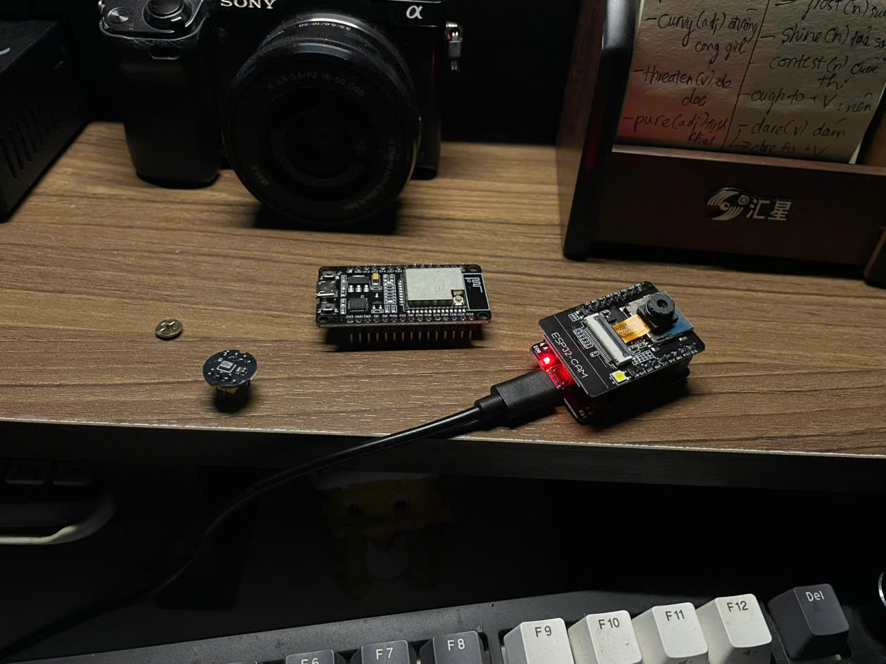

# ESP32 Audio TinyML Lab



This repository is a beginner-friendly learning lab for the **ESP32 DevKit V1**. The first goal is to understand the board, the Arduino-style development workflow, and the embedded programming concepts that matter on small devices. The long-term goal is to prepare a clean path for running **TinyML** models on the ESP32, especially models that use audio or sensor input.

## Why This Project Exists

ESP32 can look simple when the first sketch only prints text to the Serial Monitor, but it is a real microcontroller with hardware limits, boot modes, memory constraints, real-time behavior, and many peripherals. TinyML adds another layer: model size, quantization, feature extraction, inference latency, and on-device decision logic.

This lab grows in small steps:

1. Learn how the ESP32 board works.
2. Write and upload simple sketches.
3. Read signals from GPIO, ADC, I2C, SPI, UART, and I2S peripherals.
4. Collect useful data from sensors or microphones.
5. Convert trained models into microcontroller-friendly formats.
6. Run inference locally on the ESP32.
7. Measure memory, speed, accuracy, and power tradeoffs.

## Hardware Target

The current target board is:

- **Board:** ESP32 DevKit V1
- **Common module:** ESP32-WROOM-32
- **Logic voltage:** 3.3 V
- **USB power input:** 5 V through the development board USB port
- **Typical CPU:** Dual-core Tensilica LX6, up to 240 MHz
- **Wireless:** Wi-Fi and Bluetooth / BLE
- **Development style:** Arduino sketches first, then lower-level ESP32 concepts as needed

Important note: ESP32 GPIO pins are **not 5 V tolerant**. Use 3.3 V logic for sensors and modules unless a level shifter is used.

## Beginner Mental Model

An ESP32 program usually has two main parts:

```cpp
void setup() {
  // Runs once after boot or reset.
}

void loop() {
  // Runs again and again forever.
}
```

Think of `setup()` as the place where you initialize hardware, Serial output, Wi-Fi, sensors, or model memory. Think of `loop()` as the place where the board repeatedly reads input, updates state, runs logic, and writes output.

For TinyML later, this pattern often becomes:

```text
setup:
  initialize serial logs
  initialize sensor or microphone
  load model
  allocate tensor arena memory

loop:
  capture signal
  preprocess signal
  run inference
  postprocess result
  trigger action or log output
```

## Development Workflow

For the current Arduino-style workflow:

1. Install Arduino IDE or another ESP32-compatible editor.
2. Install the ESP32 board support package.
3. Connect the ESP32 DevKit V1 by USB.
4. Select an ESP32 board profile, usually **ESP32 Dev Module** for DevKit V1 boards.
5. Select the correct serial port.
6. Open an experiment sketch from `experiments/`.
7. Upload the sketch.
8. Open the Serial Monitor at the sketch baud rate, commonly `115200`.

If upload fails, hold the **BOOT** button while the IDE starts uploading, then release it when the upload begins. Some boards enter bootloader mode automatically; some need help.

## Core ESP32 Concepts

### 1. Microcontroller

The ESP32 is a microcontroller, not a full computer. It runs one firmware program directly on the chip. There is no operating system in the desktop sense, no unlimited memory, and no filesystem unless you explicitly use flash storage features.

### 2. Firmware

Firmware is the program uploaded to the board. In this lab, firmware starts as `.ino` Arduino sketches. Later, TinyML firmware may include model data, preprocessing code, and inference logic.

### 3. GPIO

GPIO means **General Purpose Input/Output**. These pins can read digital signals or drive outputs such as LEDs, buttons, relays, or control pins on modules.

Common ideas:

- `INPUT` reads a pin.
- `OUTPUT` writes a pin.
- `INPUT_PULLUP` uses an internal pull-up resistor.
- `digitalRead()` reads `HIGH` or `LOW`.
- `digitalWrite()` writes `HIGH` or `LOW`.

Some ESP32 pins have special constraints. GPIO `34` to `39` are input-only. GPIO `6` to `11` are usually connected to flash memory and should be avoided. Boot strapping pins such as GPIO `0`, `2`, `12`, and `15` need extra care because they can affect startup mode.

### 4. ADC

ADC means **Analog-to-Digital Converter**. It converts an analog voltage into a number. This is useful for potentiometers, analog sensors, simple microphones, battery monitoring, and other variable signals.

Important ESP32 detail: ADC readings are not perfectly linear, and ADC2 pins can conflict with Wi-Fi. For learning, ADC is fine. For accurate measurement, calibration matters.

### 5. PWM

PWM means **Pulse Width Modulation**. It simulates analog-like output by switching a digital signal on and off very quickly. On ESP32 Arduino, PWM is usually handled with the LEDC peripheral. It is useful for LED brightness, motor speed control, and simple audio tones.

### 6. UART and Serial

UART is a serial communication protocol. The USB cable on a DevKit board usually connects your computer to the ESP32 through a USB-to-UART chip such as CP210x or CH340.

`Serial.print()` and `Serial.println()` are your first debugging tools. They help you inspect boot messages, sensor values, model predictions, timing, and errors.

### 7. I2C

I2C is a two-wire communication bus, usually using:

- SDA: data line
- SCL: clock line

It is common for sensors such as IMUs, displays, temperature sensors, and some audio components. Multiple I2C devices can share the same bus if they have different addresses.

### 8. SPI

SPI is a faster communication bus that uses separate clock, data, and chip-select lines. It is common for displays, SD cards, some sensors, and external flash-style devices.

SPI is useful when speed matters, but it usually uses more pins than I2C.

### 9. I2S

I2S is a digital audio protocol. This matters for the future audio TinyML goal because many MEMS microphones output audio over I2S.

For audio ML, I2S can be used to capture raw audio samples, then the firmware can convert the signal into features such as spectrograms or MFCCs before inference.

### 10. Interrupts

Interrupts let the ESP32 react quickly to events such as button presses, sensor pulses, timers, or data-ready signals. Interrupt code should be short and careful. Heavy work should usually be done later in the main loop or a task.

### 11. Timers

Timers help run code at predictable intervals. They are useful for sampling sensors, blinking status LEDs without blocking, measuring inference time, and building stable audio capture pipelines.

### 12. FreeRTOS and Tasks

ESP32 uses FreeRTOS under the Arduino layer. This means the board can run tasks, schedule work, and use both CPU cores. Beginners do not need to start with tasks, but TinyML projects may eventually use them to separate audio capture, inference, logging, and connectivity.

### 13. Memory

Memory is one of the most important constraints for TinyML.

Main memory areas:

- Flash: stores firmware, constants, and model data.
- SRAM: stores variables, stacks, buffers, and runtime tensors.
- PSRAM: optional external RAM on some ESP32 boards, not always available on DevKit V1.

TinyML models need space for model bytes and temporary tensors. TensorFlow Lite for Microcontrollers uses a manually allocated memory buffer often called the **tensor arena**.

### 14. Flash Storage

ESP32 can store data in flash memory. Common options include:

- Preferences / NVS for key-value settings.
- SPIFFS or LittleFS for file-like storage.
- SD card for larger datasets or logs, if connected.

For TinyML, flash storage can be used for model versions, thresholds, labels, calibration values, or captured test samples.

### 15. Power

ESP32 can draw different amounts of current depending on Wi-Fi, CPU speed, peripherals, and sleep mode. TinyML projects that run on battery should measure power early because microphones, Wi-Fi, and frequent inference can increase consumption.

## TinyML Concepts For This Lab

### 1. TinyML

TinyML means running machine learning on very small devices. Instead of sending sensor data to a server, the ESP32 can make predictions locally.

This is useful when you want:

- Low latency
- Offline behavior
- Better privacy
- Lower network dependency
- Small real-time decisions

### 2. Inference

Inference is the act of running a trained model on new input data. On the ESP32, inference must be small enough to fit in memory and fast enough for the application.

### 3. Training vs Deployment

Training usually happens on a computer or cloud environment. Deployment happens on the microcontroller.

Typical flow:

```text
collect data -> train model -> evaluate model -> quantize model -> convert model -> embed model in firmware -> run inference on ESP32
```

### 4. Quantization

Quantization reduces model size and computation cost, often by converting floating-point values into 8-bit integers. Many microcontroller models use `int8` quantization because it is smaller and faster than `float32`.

Quantization can slightly reduce accuracy, so it must be tested with real data.

### 5. TensorFlow Lite for Microcontrollers

TensorFlow Lite for Microcontrollers, often called TFLite Micro, is a runtime for running small TensorFlow Lite models on microcontrollers. It does not depend on a full operating system and avoids dynamic memory allocation after initialization.

Core parts:

- Model byte array
- Operator resolver
- Tensor arena
- Input tensor
- Output tensor
- Inference call

### 6. Model Input

Model input must match exactly what the model was trained to expect. Shape, sample rate, normalization, feature extraction, and data type must be consistent.

For audio, this might mean:

- 16 kHz sample rate
- 1 second audio window
- 16-bit PCM samples
- Spectrogram or MFCC features
- `int8` normalized values for a quantized model

### 7. Feature Extraction

Raw sensor data often needs preprocessing before inference.

For audio models, common features include:

- Audio windows
- Short-time Fourier transform
- Spectrograms
- Mel spectrograms
- MFCCs
- Noise filtering
- Normalization

The key rule: use the same preprocessing during training and deployment.

### 8. Labels and Thresholds

The model usually outputs scores. Firmware must convert those scores into decisions.

Example:

```text
labels: ["silence", "unknown", "keyword"]
scores: [0.05, 0.20, 0.75]
decision: keyword detected
```

Thresholds prevent unstable behavior. A model might only trigger an action if a score is above `0.80` for several consecutive windows.

### 9. Latency

Latency is how long the system takes to respond. For TinyML, latency includes:

- Sensor capture time
- Preprocessing time
- Inference time
- Postprocessing time
- Output action time

Audio models often need fixed windows, so latency is not just the model runtime.

### 10. Accuracy on Device

A model that works on a laptop may behave differently on the ESP32. Real sensors have noise, different gain, different sampling rates, and real-world variation. Always test on the actual device.

## Suggested Learning Path

1. **Serial Hello:** Print messages and understand upload, reset, and Serial Monitor.
2. **GPIO Output:** Blink an LED and control a digital output.
3. **GPIO Input:** Read a button with pull-up or pull-down behavior.
4. **ADC Input:** Read an analog sensor or potentiometer.
5. **PWM Output:** Control LED brightness or generate tones.
6. **I2C Sensor:** Read a sensor over I2C.
7. **SPI Device:** Use an SPI display, SD card, or fast sensor.
8. **Wi-Fi Basics:** Connect to a local network and understand power tradeoffs.
9. **I2S Microphone:** Capture audio samples.
10. **Audio Features:** Convert audio windows into features.
11. **TinyML Hello Model:** Run a very small model.
12. **Audio TinyML Model:** Run a keyword, sound event, or simple classifier model.
13. **Profiling:** Measure memory, inference time, and stability.
14. **Deployment Polish:** Add labels, thresholds, logging, and safe error handling.

## TinyML Integration Checklist

Before adding a model to the ESP32 firmware, answer these questions:

- What problem does the model solve?
- What sensor data does it need?
- What is the input shape?
- What sample rate does it expect?
- What preprocessing was used during training?
- Is the model quantized?
- How large is the model file?
- How much tensor arena memory is required?
- Which operators does the model use?
- How long does one inference take on ESP32?
- What are the output labels?
- What threshold turns scores into actions?
- How will false positives and false negatives be tested?
- What should the device do when inference fails?

## Debugging Habits

Good embedded debugging starts with small signals:

- Print boot messages with `Serial.println()`.
- Print sensor ranges before trusting a model.
- Print free memory before and after model initialization.
- Measure elapsed time around preprocessing and inference.
- Start with one feature at a time.
- Keep pin usage documented.
- Avoid long blocking delays in code that must react quickly.
- Test with real hardware, not only assumptions.

## Common Beginner Problems

### Upload fails

Try selecting the correct serial port. If the board does not enter bootloader mode automatically, hold **BOOT** while upload starts.

### Serial Monitor shows unreadable text

The baud rate in Serial Monitor must match the sketch, for example `115200`.

### Board keeps resetting

Possible causes include weak USB power, incorrect wiring, short circuits, unstable peripherals, memory errors, or watchdog timeouts.

### Sensor values look wrong

Check voltage, ground connection, pin number, pull-up or pull-down requirements, and whether the pin supports the feature you are using.

### Wi-Fi breaks analog readings

On ESP32, ADC2 pins can conflict with Wi-Fi. Use ADC1 pins for analog readings when Wi-Fi is enabled.

### TinyML model does not work on device

Check input shape, preprocessing, quantization, label order, tensor arena size, operator support, and whether the sensor data matches training data.
