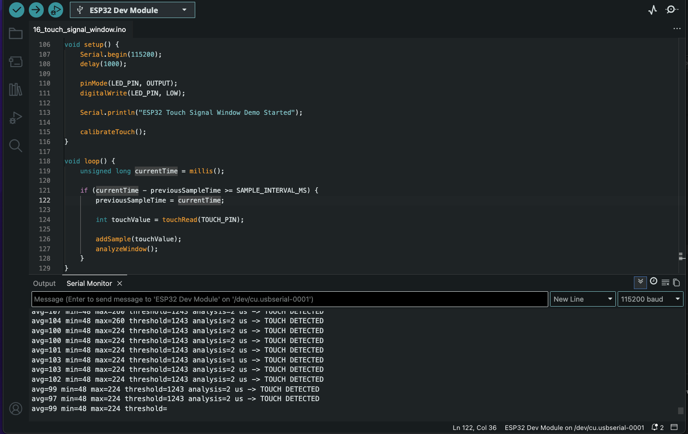

# 16 - Touch Signal Window



## Goal

This experiment reads the ESP32 capacitive touch pin over time instead of trusting a single reading. The goal is to build the habit of thinking in terms of **signals**, **windows**, **features**, and **classification**.

## Core Idea

A single `touchRead()` value can change from one moment to another because the real world is noisy. Finger pressure, humidity, USB power, nearby metal, and the surrounding environment can all affect the reading.

Instead of making a decision from one sample, this experiment collects a small window of samples:

```text
touchRead()
-> collect 50 samples
-> calculate average, minimum, and maximum
-> compare average with the threshold
-> turn LED on or off
```

## What The Code Learns

- `touchRead(4)` reads the capacitive touch value from GPIO 4.
- `WINDOW_SIZE` controls how many samples are used for one decision.
- `SAMPLE_INTERVAL_MS` controls how often a new sample is collected.
- `baseline` is the normal untouched value measured during calibration.
- `touchThreshold` is the decision boundary for detecting a touch.
- `average`, `min`, and `max` are simple features extracted from the signal window.
- `micros()` measures how long the analysis step takes.

## Result

When GPIO 4 is not touched, the average value usually stays near the baseline and the Serial Monitor prints `no touch`.

When GPIO 4 is touched, the average value usually drops below the threshold. The LED turns on and the Serial Monitor prints `TOUCH DETECTED`.

The exact numbers do not need to be identical every time. The important result is the pattern:

```text
not touched -> average stays higher
touched     -> average drops below threshold
```

## TinyML Mindset

This is a small version of a future TinyML pipeline:

```text
sensor samples
-> sample window
-> feature extraction
-> decision logic or ML inference
-> output action
```

For audio TinyML, the same idea becomes:

```text
microphone samples
-> audio window
-> spectrogram or MFCC features
-> model inference
-> label and confidence
```

This experiment proves an important lesson: embedded ML starts before the model. It starts with clean signal collection, stable preprocessing, and measurable decisions.

